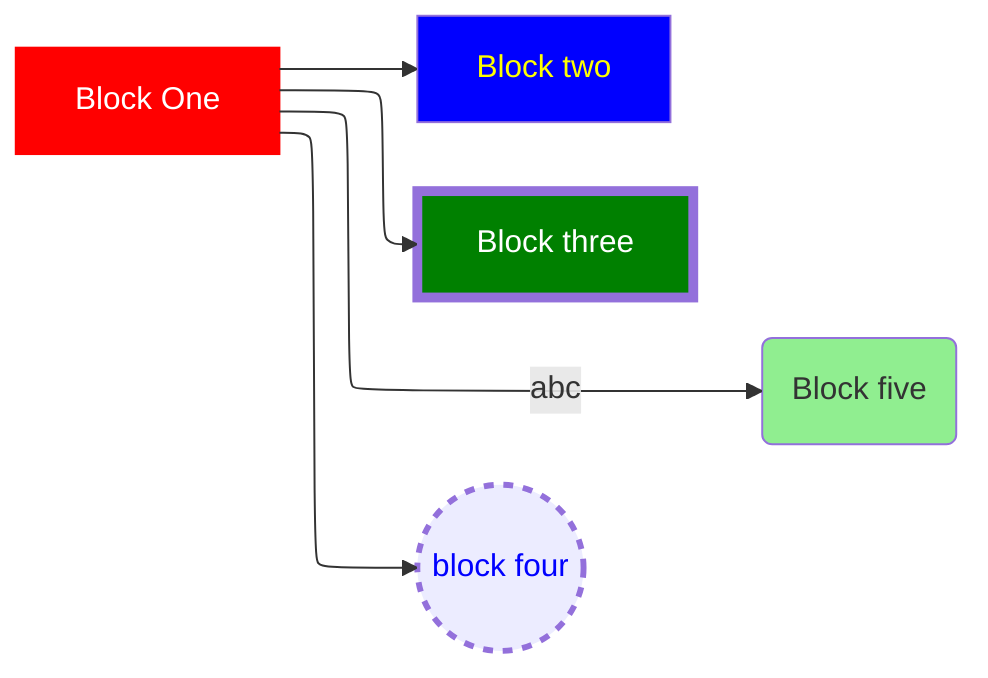

# Test Mermaid rendering
The sole purpose of this project is to test/verify the rendering capability of mermaid diagrams from the README.md

```mermaid
%%{ init: { 'flowchart': { 'curve': 'stepBefore' } } }%%
graph LR
classDef grayBlock fill:#63666a,color:#fff
b1[Block One]-->b2[Block two]
style b1 fill:red,stroke:red,shadow:shadow,color:white
style b2 fill:blue,color:yellow
b1-->b3[Block three]
style b3 fill:green,color:white,stroke-width:5px
b1-->b4((block four))
style b4 stroke-width:3,stroke-dasharray:5 5,color:blue
b1--abc-->b5(Block five)
style b5 fill:lightgreen
b1--->b6:::grayBlock/Block six]
```
## with the Elk renderer

